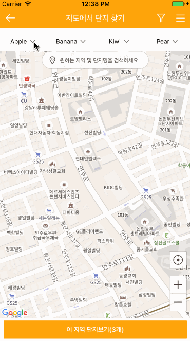

# YNDropDownMenu

[](http://cocoapods.org/pods/YNDropDownMenu)
[](http://cocoapods.org/pods/YNDropDownMenu)
[](http://cocoapods.org/pods/YNDropDownMenu)



## Requirements

`YNDropDownMenu` written in Swift 3. Maybe compatible with iOS7.0+

## Example

Init your view with frame `let view = YNDropDownMenu(frame: CGRect(x: 0, y: 20, width: UIScreen.main.bounds.size.width, height: 38), dropDownViews: _ZBdropDownViews, dropDownViewTitles: ["Apple", "Banana", "Kiwi", "Pear"])`

To run the example project, clone the repo, and run `pod install` from the Example directory first.

## Installation

YNDropDownMenu is available through [CocoaPods](http://cocoapods.org). To install
it, simply add the following line to your Podfile:

```ruby
pod "YNDropDownMenu"
```

## Author

younatics@gmail.com

## License

YNDropDownMenu is available under the MIT license. See the LICENSE file for more info.
